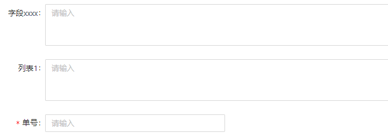
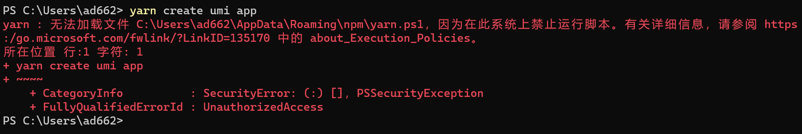
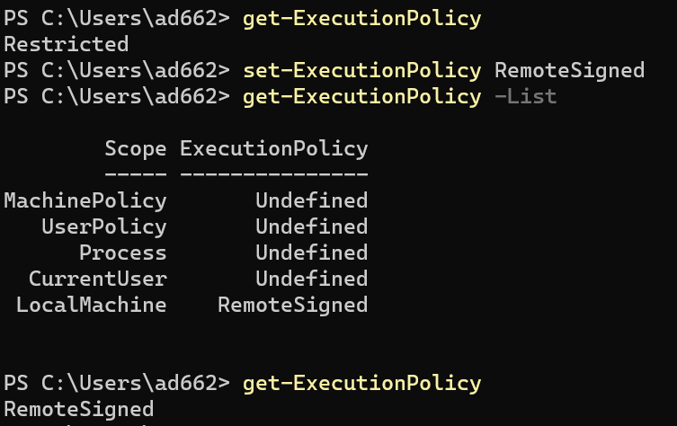
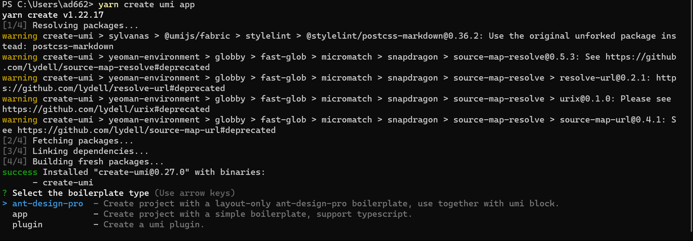
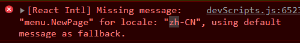

> 2023年2月8日，由于后来就直接上手项目了，因此用本博客记录一些难以解决的问题。

## 1 遇到的问题

### 1.1 异步同步问题

过去太久忘记了，只记得是拆开写，以后再遇到再记下来。

### 1.2 表单对齐问题

ANTD PRO的表单有三种布局格式：horizontal，vertical，inline。

常用horizontal。当想让标签后的输入框对齐时，可以给form加个布局。

```js
const formLayout = {
    labelCol:{
      flex:'80px'
    },
    wrapperCol:{
      flex:'1',
    },
    // 下面这也是一种，但不好用。
    // labelCol:{
    //   xs:{span:24},
    //   sm:{span:5},
    //   md:{span:4},
    //   xxl:{span:2},
    // },
    // wrapperCol:{
    //   xs:{span:24},
    //   sm:{span:19},
    //   md:{span:20},
    //   xxl:{span:22},
    // },
  };
<ProForm {...formLayout}/>
```

效果如下：



## 2 Ant Design Pro 前端学习

> 文档：[Ant Design Pro文档](https://pro.ant.design/zh-CN/docs/overview)

### 2.1 准备工作

#### 2.1.1 推荐技术栈

- 包管理：tyarn 安装`npm install yarn tyarn -g`
  文档：[tyarn](https://www.npmjs.com/package/tyarn)

- Terminal：选择Windows Terminal
  
#### 2.1.2 快速开始

- 初始化脚手架

```sh
#使用yarn
yarn create umi app
```

- 遇到的问题
  

- 解决方案：[官方解释](https://docs.microsoft.com/zh-cn/powershell/module/microsoft.powershell.core/about/about_execution_policies?view=powershell-7)
  </br>因此修改一下powershell的保护机制即可解决。使用`set-executionpolicy remotesigned`的命令。效果如下：
  

  再次安装，效果如下，成功安装：
  

### 2.2 基础结构

#### 2.2.1 目录结构

```sh
├── config                   # umi 配置，包含路由，构建等配置
├── mock                     # 本地模拟数据
├── public
│   └── favicon.png          # Favicon
├── src
│   ├── assets               # 本地静态资源
│   ├── components           # 业务通用组件
│   ├── e2e                  # 集成测试用例
│   ├── layouts              # 通用布局
│   ├── models               # 全局 dva model
│   ├── pages                # 业务页面入口和常用模板
│   ├── services             # 后台接口服务
│   ├── utils                # 工具库
│   ├── locales              # 国际化资源
│   ├── global.less          # 全局样式
│   └── global.ts            # 全局 JS
├── tests                    # 测试工具
├── README.md
└── package.json
```

#### 2.2.2 页面开发使用图表

使用Ant Design的图表：`yarn add @ant-design/charts`

#### 2.2.3一些报错

##### 网页控制台



- 解决方案

locales缺少对应字段的中文配置
