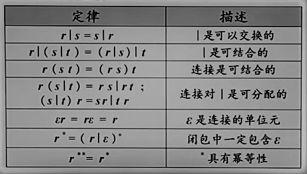

## 1 引论
> 背书.GIF
## 2 编译基础知识
### 2.1 高级语言
程序语言是一个记号系统。
`语言=语法+语义`
### 2.2 语法
>语法：使得字符形成一个形式上正确的程序
`语法=词法规则 + 语法规则`
#### 2.2.1 单词符号
单词符号：语言中具有独立意义的基本结构
<font size='3' color='#6495ED'>一般来说有：常数，标识符，基本字，算符，界限符</font>

词法规则：规定字母表哪些字符串是单词符号
可以使用<font size='3' color='#6495ED'>正规式和有限自动机</font>来描述词法结构和进行词法分析

#### 2.2.2 语法单位
语法单位：表达式，子句，语句，函数，过程，程序

语法规则：规定了如何从单词符号来形成语法单位

> 语言的`词法规则`和`语法规则`定义了程序的形式结构，是判断输入字符是否构成一个形式上正确的程序的依据。

### 2.3 字母表和符号串
#### 2.3.1 概念
1. 字母表：非空有穷集合；用&Sigma;和V表示
2. 符号：是语言中最基本的不可再分的单位 
3. 符号串：空串&xi;
4. 句子：字母表上符合某种规则构成的串
5. 语言：句子的集合

>习惯：a,b,c,...表示符号；&alpha;,&beta;,&upsilon;,...表示符号串；A,B,C,...表示集合。
#### 2.3.2 符号串的集合
1. 连接（乘积）运算：<font size='3' color='#6495ED'>类似笛卡尔积</font>，若A={&alpha;<sub>1</sub>,&alpha;<sub>2</sub>,&alpha;<sub>3</sub>,...},B={&beta;<sub>1</sub>,&beta;<sub>2</sub>,&beta;<sub>3</sub>,...},则AB={&alpha;&beta;|&alpha;&in;A且&beta;&in;B}
- 串集自身的乘积称作串集的方幂
- A<sup>0</sup>={&xi;}
- 字母表A的n次幂是字母表A上所有长度为n的串集
- 乘积有顺序的A={a,b};B={c,e,d},则AB={ac,ad,ae,bc,bd,be} `ac`的顺序不可调换
   <br>
2. 字母表的闭包 **A<sup>*</sup>**= A<sup>0</sup> &bigcup; A<sup>1</sup> &bigcup; A<sup>2</sup> &bigcup; ... <br><font size='3' color='#6495ED'>即由A上符号组成的所有穿的集合，包括空串&xi;</font><br>
字母表的正闭包 **A<sup>+</sup>**= **A<sup>*</sup>** - {&xi;}

> 字母表上的语言是字母表上正闭包的子集

### 2.4 文法与语言
#### 2.4.1 文法的概念
> 文法是描述语言的语法结构的形式规则
1. 非终结符：出现在规则左部；大写字母或用`<>`括起来，表示一定语法概念的词；用 V<sub>N</sub>表示
2. 终结符：语言中不可分割的字符串，是组成句子的基本单位；用V<sub>T</sub>表示。
3. 开始符号：<font size='3' color='#6495ED'>又称识别符号</font>，所定义语法范畴的非终结符
4. 产生式：形式 A &rightarrow; &alpha;，A产生&alpha;
5. 推导：事实上，你替换任何一个都可以...<br><font size='3' color='#6495ED'>最左（右）推导：<br>每次使用一个规则，以其右部取代符号串最左（右）非终结符<br></font>`都为规范推导`
6. 归约：归约是推导的逆过程，最左（右）归约是最右（左）推导的逆过程<br>`都为规范归约`<br><font size='3' color='#6495ED'>若某个父亲节点的所有孩子都为叶子节点时才能归约</font>
7. 句型、句子和语言
- 句型：
- 句子：
- 语言：
8. 语法扩充：BNF、元语言符号（指路第一章）

#### 2.4.2 文法与语言的形式定义
1. Chomsky的定义：G(V<sub>N</sub>,V<sub>T</sub>,P,S)
2. Chomsky的分类：
- 0型文法：（短语文法或无限制文法）P中产生式&alpha;&rightarrow;&beta;,&alpha;&in;V<sup>+</sup>并至少含有1个非终结符，&beta;&in;V<sup>*</sup><br><font size='3' color='#6495ED'>识别0型文法的自动机为图灵机；产生式限制最少，可枚举，可递归</font>
- 1型文法：定义看书P25;<br>（上下文有关、长度增加文法）<br><font size='3' color='#6495ED'>识别1型文法的自动机为线性界限自动机；理解定义：非终结符替换必须在某个特定的上下文中且不可替换为&xi;，除非是S&rightarrow;&xi;</font>
- 2型文法：上下文无关<br><font size='3' color='#6495ED'>识别1型文法的自动机为下推自动机（PDA）</font><font size='3' color='#DC143C'>是判断句子是否正确的标准</font>
- 3型文法：正规文法，非终结符全在最右边`右线性文法`or最左边`左线性文法`or没有） <br><font size='3' color='#6495ED'>识别3型文法的自动机为有限状态自动机</font><br><font size='3' color='#DC143C'>是判断单词是否正确的标准</font>
>上下文无关文法包含了正规文法
3. 文法分类的具象表现
- 0型文法　 &alpha;&rightarrow;&beta;
- 1型文法 　&alpha;A&beta;&rightarrow;&alpha;&upsilon;&beta;
- 2型文法　 A&rightarrow;&alpha;（任意符号串）
- 3型文法　 A&rightarrow;B&alpha;|&alpha;<br>　　　　　A&rightarrow;&alpha;B|&alpha;
4. 文法化简的步骤
5. 构造无&xi;产生式的上下文无关文法的条件<font size='3' color='#6495ED'> (&xi;规则)</font>
- P中要么不含有&xi;产生式，要么只有S&rightarrow;&xi;
- 若S&rightarrow;&xi;，则S不出现在任何产生式的右部

### 2.5 语法树与文法的二义性
#### 2.5.1 语法树
1. 定义：用来表示语言句子结构的树
2. 作用：易于判断文法二义性

#### 2.5.2 语法树的一些概念
1. 句型：在一棵语法树生长过程中的任何时刻，所有那些叶子节点排列起来就是一个句型
2. 短语：子树的末端符号自左向右连成串，相对于子树树根而言称为短语<br>简单短语（直接短语）：若短语是某子树根进过一步推导得到的
3. 句柄：句型中的最左简单短语；句柄是最左归约时要寻找的简单短语 

#### 2.5.3 文法的二义性
1. 句子二义性：若一个句子存在对应的两棵或两棵以上的语法树，则句子是二义的
2. 文法二义性：有句子二义性的文法

## 3 词法分析
###  3.1 正则表达式（正规式）
> 用来描述正则语言更紧凑的表示方法
1. 定义：正则表达式可以由较小的正则表达式按照特定规则递归地构建。每个正则表达式r定义一个语言L(r)
2. 若r,s都是RE<br>r|s是RE, L(r|s)=L(r) &bigcup; L(s)<br>rs是RE, L(rs)=L(r)L(s)<br>r<sup>* </sup>是RE, L(r<sup>* </sup>)=(L(r))<sup>*</sup><br>(r)是RE, L((r))=L(r)
> 运算优先级：() &rightarrow; * &rightarrow; 连接 &rightarrow; |

3. RE的代数定律
   <br>
### 3.2 正则定义
> 给一些RE命名， 并在之后的RE中像使用字母表中的符号一样使用这些名字

### 3.3 有穷自动机(FA)
> 经典例子：电梯控制装置
#### 3.3.1 转换图（Transition Graph）
- 结点：FA的状态<br>初始状态(开始状态)：只有一个，由start箭头指向 <br>终止状态(接收状态)：可以有多个，用**双圈**表示
- 带标记的有向边：边上标记为输入

#### 3.3.2 FA定义(接收)的语言<br>
   输入串能让有穷状态机从初始状态转换到终止状态，该串被接收。<br>
   所有可接收串构成的集合为FA定义（或接收）的语言，记为L(M)
#### 3.3.3 有穷自动机的分类
1. 确定的FA(Deterministic finite automata, DFA)
- 定义为五元组 M=(K,&Sigma;,f,S,Z),书P48
- DFA即可以用**转换图**表示，也可以用**转换表**表示
2. 非确实的FA(Nondeterministic finite automata, NFA)
- 与DFA的唯一区别：沿着标记能到达的状态不唯一
- NFA的边上还能标记&xi;, 带有“&xi;-边”的NFA
>  带有“&xi;-边”的NFA与不带“&xi;-边”的NFA等价
> DFA与NFA具有等价性<br>
> DFA与RE也等价<br>
> 四者相互等价
3. DFA与NFA比较
- DFA计算机更好实现
- NFA更加直观 
4. DFA的算法实现
```
K=S；
c=getchar();//当前输入符号
while (c<>eof()) 
{K=f(K,c);
c=getchar();
}
if (K in Z) return (“yes”)//遇到文件结束符号
else return (“no”)
```
#### 3.3.4 从正则表达式到有穷自动机
1. 从RE到NFA
- 套用下面

2. 从NFA到DFA


```
<font size='3' color='#6495ED'></font>
<font size='3' color='#DC143C'></font>
```
