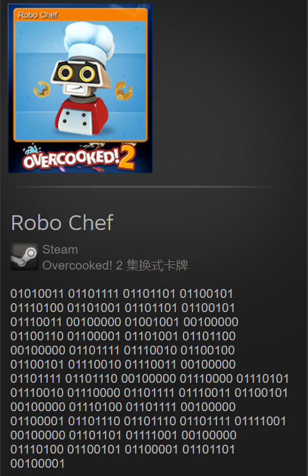

## 小小发现
某天深夜在一晚上酣畅淋漓的游戏后，在退出Steam时瞟了一眼库，突然发现一个有趣的东西。

当下直觉觉得是ASCII码，于是采用比较熟悉的C++尝试翻译。
代码如下：
```cpp
#include <iostream>
#include <cstdlib>
#include <cstdio>
#include <stack>
#include <queue>
#include <windows.h>

using namespace std;

//all
string s;
int i=0;
int j=7;
//2 to 10
string s1;
queue <int> ansNum;

//翻译后压入队列
void translateToNum()
{
    int tempans=0;
    int temp=1;
    for(int k=0;k<8;k++)
    {
        tempans = tempans + temp*(s1[k]-'0');
        temp = temp*2;
    }
    ansNum.push(tempans);
}

int main()
{
    //s为卡片上的字符串
    s="01010011 01101111 01101101 01100101 01110100 01101001 01101101 01100101 01110011 00100000 01001001 00100000 01100110 01100001 01101001 01101100 00100000 01101111 01110010 01100100 01100101 01110010 01110011 00100000 01101111 01101110 00100000 01110000 01110101 01110010 01110000 01101111 01110011 01100101 00100000 01110100 01101111 00100000 01100001 01101110 01101110 01101111 01111001 00100000 01101101 01111001 00100000 01110100 01100101 01100001 01101101 00100001";
    while(s[i]!='\0')
    {
        if(s[i]==' ')
        {
            translateToNum();
            j=7;
        }
        else
        {
            s1[j]=s[i];
            j--;
        }
        i++;
    }

    while(!ansNum.empty())
    {
        char tempChar;
        int tempInt;
        tempInt = ansNum.front();
        tempChar =tempInt;
        ansNum.pop();
        //cout<<tempInt;
        cout<<tempChar;
    }

    //system("pause");
    return 0;
}

```
运行结果：
