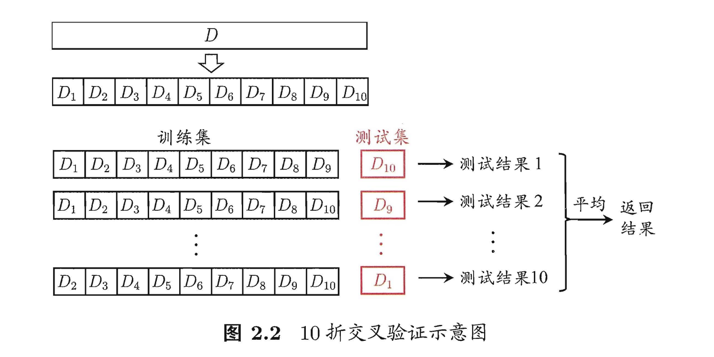

---

title: 机器学习之旅
date: 2022-03-28 22:04:00
tags: Machine Learning

---

# 机器学习之旅

> 考研有机会能上岸，因此下决心开始学习机器学习。
>
> 学习视频：[一起啃书机器学习西瓜书白话解读](https://www.bilibili.com/video/BV17J411C7zZ?p=1)
>
> 学习教材：西瓜书
>
> 学习代码：[西瓜书代码](https://github.com/yui73/pumpkin-book)

## 0 准备工作 

## 1 绪论

### 1.1 数据相关术语

- 数据集
- 样本
- 特征向量
- 属性

### 1.2 模型

- 有监督学习
  - 分类（二分类 - Y正负 / 多分类 - Y大于2）
  - 回归（Y = R实数集）
- 无监督学习
  - 聚类（我们不知道几类，机器自己分）

### 1.3 预测

- 测试
- 测试样本
- **泛化能力**

### 1.4 假设空间

科学的推理手段

- 归纳（特殊到一般）
  - 狭义（从数据集中得到概念-抽象）
  - 广义（从样本中学习）
- 演绎（一般到特殊）

### 1.5 归纳偏好

对同一个数据集训练了不同的模型，如何选择模型。**根据“奥卡姆剃刀”。**

## 2 模型评估与选择 --- 重要
### 2.1 一种训练集一种算法
- 经验误差于过拟合
错误率：E=a/m
精度：1-E
误差：|Y-Y'|

过拟合的定义：把训练样本自身的一些特点当作了所有潜在样本都会具有的一般性质，这样就会导致泛化能力的下降。

欠拟合的定义：对训练样本的一般性质尚未学好。

- 模型评估方法
  - 泛化能力
  
  - Trainning Set 训练集
  
  - Testing Set 测试集的保留方法
    1. 留出法
        直接将数据集划分为两个互斥集合，其中一个作为训练集S,一个作为测试集T。在S上训练模型，用T测试误差，估计泛化误差。
    
    2. 交叉验证法
    
       **业界常用**
    
       
    
    3. 自助法 
    
          
    
  - Validation Set 验证集

- 性能度量

